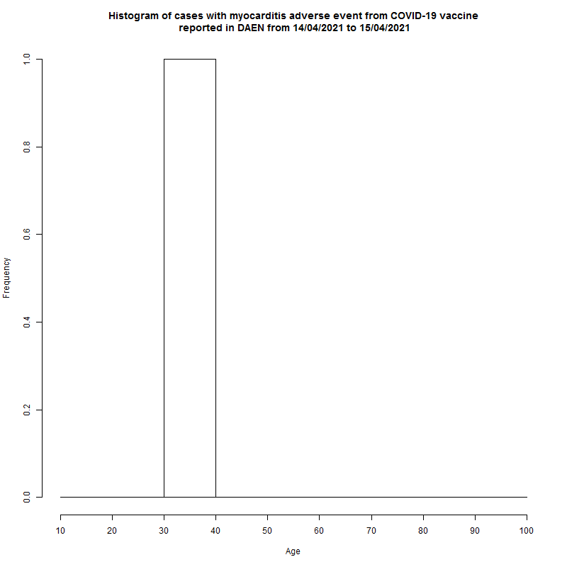

# AccessibleAdverseEventNotification
Making the DAEN information accessible.

The purpose of this repository is to make the information on Australian COVID-19 adverse events accessible. The Therapeutics Goods Administration (TGA) keeps a database of adverse reactions to medications including the COVID-19 vaccines. This Database of Adverse Event Notifications (DAEN) is available to the public via [this awful web interface](https://apps.tga.gov.au/PROD/DAEN/daen-entry.aspx). The most recent two weeks is never available.

The DAEN website doesn't provide information in a format that might be useful for analysis. Instead you have to scrape the information by entering each individual day and collecting the results from two tables which might span multiple pages. I've already done that and the code is [here](code/DAEN_scrape.py) (this code isn't great, but it is good enough to get the job done).

Please be aware that the numbers reported in DAEN are probably significantly less than the actual number of adverse events and deaths. [As the DAEN website states](https://www.tga.gov.au/about-daen-medicines):
> Adverse event reports from consumers and health professionals to the TGA are voluntary, so there is under-reporting by these groups of adverse events related to therapeutic goods in Australia. This is the same around the world.

The scraped data is found in the data directory. These files are tab separated files which you can easily import in to a spreadsheet program. All of the files are only for COVID-19 vaccines.
- [DAEN_webscrape_simple.txt](data/DAEN_webscrape_simple.txt) This file shows the date (twice for reasons that made sense at the time, but don't necessarily make sense anymore), the number of cases reported that day, the number of cases with a single suspected medicine for that day, and the number of deaths reported that day.
- [DAEN_webscrape_medsummary.txt](data/DAEN_webscrape_medsummary.txt) This file gives a daily count of each adverse event category. Please note that if one patient had multiple adverse events, then each event would be counted in the appropriate category.
- [DAEN_webscrape_listofreports.txt](data/DAEN_webscrape_listofreports.txt) This file provides the individual reports and includes sex and age (when recorded).

[Figure 1](graphs/DAEN%20cases.png) shows some of the basic information such as number of adverse events and deaths reported each day for the COVID-19 vaccines, myocarditis, pericarditis and the more general term cardiac disorder. 

Figure 1.

[Figure 2](graphs/DAEN%20histogram%20myocarditis%20age.png) shows a histogram of reported cases of myocarditis and pericarditis from the COVID-19 vaccine. Please note that the age group 10-19 is somewhat distorted as the age 10-11 should not receive the vaccine (although there are cases of [8 year olds getting the vaccine](graphs/DAEN%20young%20vaccinated.png) when that should not have occurred). This age group also has a significantly lower uptake than other age groups.

Figure 2.

Figures 3 and 4 plot the reports of myocarditis by age grouped by sex or manufacturer respectively. Figures 5 and 6 are the same for pericarditis. A '-' is used where an age was not given in the report.

Figure 3.

Figure 4.

Figure 5.

Figure 6.

Figure 7 shows how the histogram for myocarditis has progressed over time. 

  
Figure 7.

Figure 8 shows the death rate of people in Australia who contracted COVID-19. Data taken from [health.gov](https://www.health.gov.au/news/health-alerts/novel-coronavirus-2019-ncov-health-alert/coronavirus-covid-19-case-numbers-and-statistics#cases-and-deaths-by-age-and-sex) on 1/12/2021. Bottom graph is zoomed in to 1% to see what is happening with those under the age of 60.

  
Figure 8.

According to the [ABS](https://www.abs.gov.au/statistics/people/population/life-tables/latest-release) (accessed 2/12/2021), the life expectancy at birth for Australians was 81.2 and 85.3 years for males and females respectively in 2018-20. This is the life expectancy of a child born now, this a much higher life expectancy than a child born in the 1930's. It might be useful to work out how many years of life Australians have lost due to COVID-19. The people most likely to die have existing health issues and would have a shorter life expectancy than the ABS figures above, but for simplicity the ABS values will be used. The mean age of any 10 year group is going to be higher than the average of the limits of the group, for simplicity the assumption is that the average age is 7 higher than the minimum for that group. From table 1 below, the human-years lost in Australia of people who had COVID-19 is 6,894 in males and 4,860 in females, and 11,754 in total.

Table 1

The mortality rate of myocarditis has been estimated as 56% at 4.3 years ([Mason et al. 1995](https://pubmed.ncbi.nlm.nih.gov/7596370/)). For simplicity, assume that on average 50% die within 3 years and the other 50% survive (there are a lot of assumptions here for simplification, there isn't a huge amount of data on myocarditis in children, so the survival rate could be different). 

When this calculation was done (DAEN records to 18/11/2021) there were nine records in DAEN with myocarditis that did not include the sex and 104 records that did not include the age, so these are omitted from the calculation. The assumed death age needs to account for the heavy weighting of younger ages and add 3 years. For simplicity assume 6 years over the minimum age for the group. This gives a loss of human-years of 10,528 in males and 5,250 in females for a total of 15,778.

This does not account for the issue of under-reporting. This number is quite difficult to estimate, and will probably be heavily related to prior assumptions of the people that might submit a record. It is possible that under-reporting could be as low as [1 in 200](https://www.bmj.com/rapid-response/2011/11/02/underreporting-vaccine-adverse-events) <if you are aware of better references, please make a note in the discussion section>. For now, assume the under-reporting is 1 in 10. If these assumptions are correct then Australia has lost 158,000 human-years for a disease that has been blamed for the loss of 12,000 human-years.

Figure 9.
