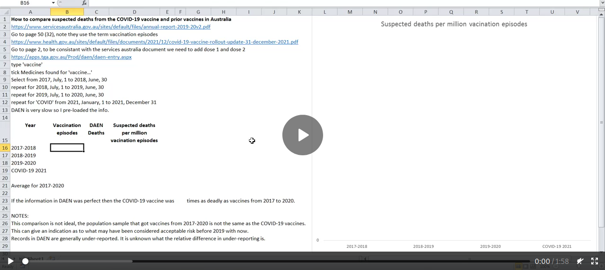

# AccessibleAdverseEventNotification
Making the DAEN information accessible.

**NOTE - I have recently discovered that entries in DAEN are constantly changing. The data set was originally scraped on 19/11/2021, and then added to daily as each extra day was available. A whole lot of new adverse events have appeared dated mid-September to mid-October. There was a net decrease of 131 pericarditis and net gain of 3 myocarditis adverse events between the earlier and more recent scraping.**

The purpose of this repository is to make the information on Australian COVID-19 adverse events accessible. The Therapeutics Goods Administration (TGA) keeps a database of adverse reactions to medications including the COVID-19 vaccines. This Database of Adverse Event Notifications (DAEN) is available to the public via [this awful web interface](https://apps.tga.gov.au/PROD/DAEN/daen-entry.aspx). The most recent two weeks is never available.

The DAEN website doesn't provide information in a format that might be useful for analysis. Instead you have to scrape the information by entering each individual day and collecting the results from two tables which might span multiple pages. I've already done that and the code is [here](code/DAEN_scrape.py) (this code isn't great, but it is good enough to get the job done).

Please be aware that the numbers reported in DAEN are probably significantly less than the actual number of adverse events and deaths. [As the DAEN website states](https://www.tga.gov.au/about-daen-medicines):
> Adverse event reports from consumers and health professionals to the TGA are voluntary, so there is under-reporting by these groups of adverse events related to therapeutic goods in Australia. This is the same around the world.

The scraped data is found in the data directory. These files are tab separated files which you can easily import in to a spreadsheet program. All of the files are only for COVID-19 vaccines.
- [DAEN_webscrape_simple.txt](data/DAEN_webscrape_simple.txt) This file shows the date (twice for reasons that made sense at the time, but don't necessarily make sense anymore), the number of cases reported that day, the number of cases with a single suspected medicine for that day, and the number of deaths reported that day.
- [DAEN_webscrape_medsummary.txt](data/DAEN_webscrape_medsummary.txt) This file gives a daily count of each adverse event category. Please note that if one patient had multiple adverse events, then each event would be counted in the appropriate category.
- [DAEN_webscrape_listofreports.txt](data/DAEN_webscrape_listofreports.txt) This file provides the individual reports and includes sex and age (when recorded).

[Figure 1](graphs/DAEN%20cases.png) shows some of the basic information such as number of adverse events and deaths reported each day for the COVID-19 vaccines, myocarditis, pericarditis and the more general term cardiac disorder. The most common MedDRA reaction terms in the Cardiac disorders classification are also listed.

Figure 1.

[Figure 2](graphs/DAEN%20histogram%20myocarditis%20age.png) shows histograms of reported cases of myocarditis and pericarditis from the COVID-19 vaccine. The younger age groups have a significantly lower and delayed uptake compared with other age groups. Figure 3 shows how the histograms have progressed over time. The age groupings have been changed to reflect age groupings from [vaccine rollout data](https://www.health.gov.au/resources/collections/covid-19-vaccination-daily-rollout-update).

Figure 2.

  
Figure 3.

Figure 4 estimates the number of myocarditis and pericarditis cases reported in DAEN per 100,000 people that received two doses. This used DAEN data to 7/1/2022 and the [vaccination numbers](https://www.health.gov.au/resources/collections/covid-19-vaccination-daily-rollout-update) released by the Australian Government for 30/12/2021. An equal number of males and females receiving the vaccination for each group was assumed, as precise numbers were not available. Please note that records in DAEN for myocarditis and pericarditis that excluded sex or age information were not used in this calculation (16% of myocarditis and 21% of pericarditis cases excluded age or sex information).

Figure 4.

Figures 5 and 6 plot the reports of myocarditis by age grouped by sex or manufacturer respectively. Figures 7 and 8 are the same for pericarditis. A '-' is used where an age was not given in the report.

Figure 5.

Figure 6.

Figure 7.

Figure 8.

Figure 9 shows the case fatality rate of people in Australia who contracted COVID-19. Data taken from [health.gov](https://www.health.gov.au/news/health-alerts/novel-coronavirus-2019-ncov-health-alert/coronavirus-covid-19-case-numbers-and-statistics#cases-and-deaths-by-age-and-sex) on 30/1/2022. Bottom graph has a logarithmic y-axis to see what is happening with those under the age of 60.

  
Figure 9.

Figure 10 shows the results from DAEN searches using the term 'vaccine' to look at all adverse event and death records for each year from 2000 to 2021. In 2021 there were 737 deaths suspected to be from the COVID-19 vaccine recorded in DAEN and two from all other vaccines combined. There were 98,876 adverse event cases recorded in DAEN from the COVID-19 vaccines and 1,217 from all other vaccines. Please note, this is not normalised for the number of vaccines administered (which would probably be a more useful comparison).

Figure 10.

Figure 11 attempts to estimate the number of adverse events and deaths per vaccine. This is a work in progress and the numbers will change as more information is discovered about prior vaccination numbers. To me it looks like the COVID-19 vaccines have a suspected death rate per million vaccinations that is 184 times the average of 2000 to 2020.

There are some significant problems with this comparison. The group of people that received the COVID-19 vaccine is not the same as the group that recevied the other vaccines. This is lumping all adverse events in together which can range from a sore arm to a heart attack. If you want to follow along (and I suggest you check my working, don't believe me, please always check everything), the DAEN data can be collected by going [here](https://apps.tga.gov.au/Prod/daen/daen-entry.aspx). For "Select medicines" type "vaccine" and tick the box "Medicines found for 'vaccine…'"
Then select the desired year and look at the "Number of reports (cases):" and " Number of cases where death was a reported outcome:"
Repeat for each relevant year. For 2021 I only collected results for "COVID" in selected medicines.

Get population information (in one of the spreadsheets) [here](https://www.abs.gov.au/statistics/people/population/national-state-and-territory-population/jun-2021)

Get COVID vaccination numbers [here](https://www.health.gov.au/resources/publications/covid-19-vaccine-rollout-update-31-december-2021)

Get childhood vaccination rates and number of vaccinations [here](https://www.health.gov.au/health-topics/immunisation/childhood-immunisation-coverage/current-coverage-data-tables-for-all-children)

I used the estimate of influenza vaccination of 39% of the 18+ population from [here](https://www.health.gov.au/sites/default/files/report-newspoll-flu-vaccinations-survey-jun-2014.pdf)

I decided to only consider the number of 'fully vaccinated' as a single vaccination instance rather than count each dose. I only looked at one, two and five year old children since that data set was easy to find. There are a lot more vaccinations that I didn't count that would make the difference even larger (i.e. even worse for the COVID-19 vaccines). I think the biggest potential error is using the estimate of influenza vaccinations for the population over 18 years of age from 2014, I am not sure how accurate that estimate is and if it is safe to assume the same for other years.

Here is another way to compare the COVID-19 vaccine safety to previous vaccines (webm video opens in new page):

Sources:

https://www.servicesaustralia.gov.au/sites/default/files/annual-report-2019-20v2.pdf

https://www.health.gov.au/sites/default/files/documents/2021/12/covid-19-vaccine-rollout-update-31-december-2021.pdf

https://apps.tga.gov.au/Prod/daen/daen-entry.aspx
