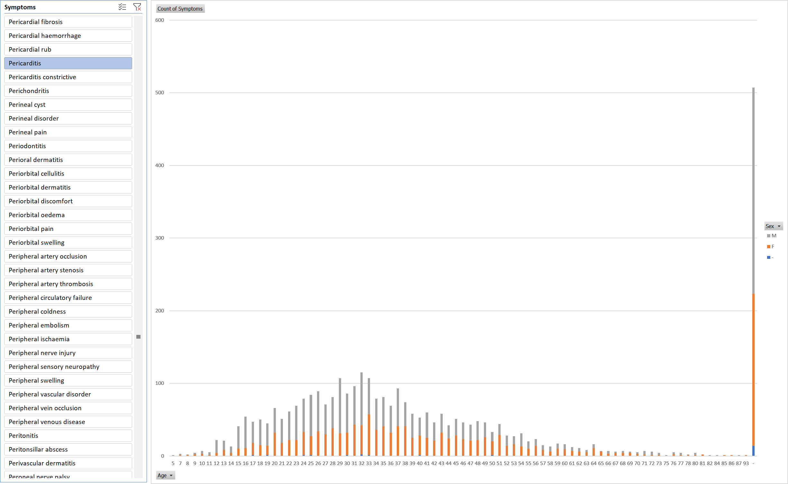

To use the AccAEN pivot table you will need this file:

[AccAEN_pivot_table.xlsx](https://github.com/AccAEN/AccessibleAdverseEventNotification/raw/main/data/AccAEN_pivot_table.xlsx) (all records fully up to date on 14/5/2022)

You can update the spreadsheet to the latest DAEN scrape with this file:

[DAEN_webscrape_listofreports_v2.zip](https://github.com/AccAEN/AccessibleAdverseEventNotification/raw/main/data/DAEN_webscrape_listofreports_v2.zip) (this is the latest file which is updated most weekdays)

Open up the spreadsheet and follow the instructions to impress your friends and enemies with cool graphs like this:

[Back to main page](https://github.com/AccAEN/AccessibleAdverseEventNotification/blob/main/README.md)
