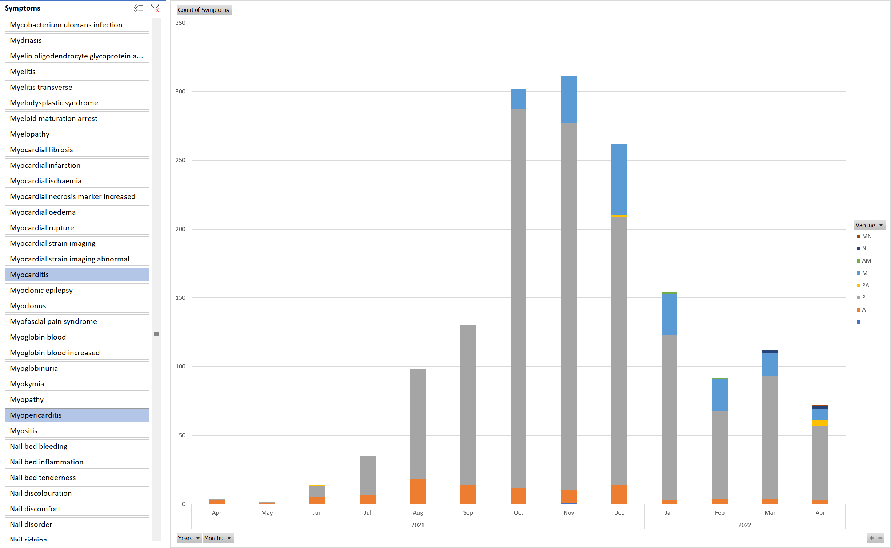

To use the AccAEN pivot table you will need to download two files:

[AccAEN_pivot_table.xlsx](https://github.com/AccAEN/AccessibleAdverseEventNotification/raw/main/data/AccAEN_pivot_table.xlsx) (all records fully up to date on 13/5/2022)

[DAEN_webscrape_listofreports_new.zip](https://github.com/AccAEN/AccessibleAdverseEventNotification/raw/main/data/DAEN_webscrape_listofreports_new.zip) (this is the latest file which is updated most weekdays)

Open up the spreadsheet and follow the instructions to impress your friends and enemies with cool graphs like this:

